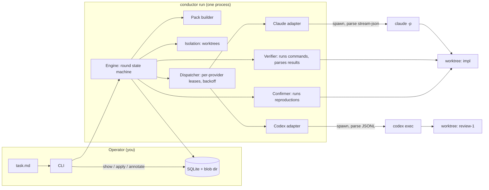

# 01 — Architecture

## Three candidate shapes

### A. Single foreground process: library + CLI (recommended)

`conductor run task.md` is one process. It owns the loop, spawns workers as
child processes in their own process groups, runs verification itself, and
writes everything to SQLite as it goes. When it exits, nothing is running. A
second invocation can inspect or resume any run from the database.

- Pro: one failure domain, trivially killable, no lifecycle management, no IPC,
  state is inspectable with `sqlite3`.
- Pro: the engine is a plain object; a daemon or UI can host it later without
  changing it.
- Con: no cross-session queue. Two tasks means two terminals, and the
  per-provider concurrency limit must be enforced through the database
  (a lease table), not in-process memory.
- Con: closing the terminal kills the run. Mitigated by `nohup`/tmux for now
  and by resumability from the database.

### B. Daemon + thin CLI

A `launchd`-managed service holds the queue and the semaphores; the CLI talks
to it over a unix socket; a web UI attaches to the same socket.

- Pro: real queueing across sessions, one place for quota state, natural
  host for a UI.
- Con: a second failure domain, service lifecycle, socket protocol, upgrade
  dance, and every bug now has "is the daemon stale?" as a first question.
- Verdict: correct shape for milestone 5 or later, if the queue is ever
  actually needed. Not v1. Shape A's engine is designed to be hosted by it.

### C. Orchestrate from inside Claude Code

Skills and subagents drive the loop; Codex is invoked via Bash for review.

- Pro: a day of work; uses your existing skills natively.
- Con: no isolation, no structured verdicts, no persistence beyond
  transcripts, loop control in a prompt, and the control layer is one of the
  two vendors. Cannot satisfy constraints 3, 4, or 6.
- Verdict: the week-one experiment, not the product. See
  [10-milestones.md](10-milestones.md) M0.

## Recommendation: A, designed so that B can host it



Dependency direction is strictly inward: CLI → Engine → {Pack, Isolation,
Dispatcher, Verifier, Confirmer, Store}; Dispatcher → adapter-api; adapters →
adapter-api only. Adapters never import the engine. The engine never imports
an adapter by name; it resolves them from config.

## One round, end to end

```mermaid
sequenceDiagram
  participant O as Operator
  participant E as Engine
  participant I as Isolation
  participant P as Pack
  participant D as Dispatcher
  participant W as Worker (CLI)
  participant V as Verifier
  participant C as Confirmer
  participant S as Store

  O->>E: conductor run task.md
  E->>S: create task, run, round 1
  E->>I: worktree impl @ base_sha; run setup
  E->>P: render pack (task, instructions, context) → pack_id
  E->>D: implementer job (cwd=impl, policy=workspace-write)
  D->>W: spawn claude -p … (own process group)
  W-->>D: events (stream), exit
  D-->>E: WorkerResult + classification
  E->>I: diff impl vs base_sha (excluding .conductor/) → patch
  E->>V: run verification steps in impl
  V-->>E: VerificationResult
  alt verification failed
    E->>D: implementer fix sub-round (same worktree, resume if able)
  else verification passed
    E->>I: worktree review-1 @ base_sha + apply patch
    E->>P: reviewer pack (+DIFF.patch, +REPORT.json)
    E->>D: reviewer job (cwd=review-1, policy=workspace-write, other provider)
    D->>W: spawn codex exec …
    W-->>D: events, exit; verdict.json in .conductor/out/
    E->>I: harvest reproduction files named in verdict
    E->>C: run each reproduction in impl → confirmed / refuted / needs_human
    C-->>E: confirmation results
    E->>S: persist verdict + confirmations
    E->>E: decide: converged | iterate | escalate | abort
  end
  E-->>O: summary, worktree path, patch path; gate if configured
  O->>E: conductor apply <run>  (only write to the primary checkout, ever)
```

## Invariants the architecture enforces

1. **One writer per tree.** Exactly one worker process runs in a given
   worktree at a time, and the verifier runs only after that process has
   exited. The reviewer never runs in the implementer's tree.
2. **Nothing leaves a reviewer tree except named files.** Harvest is by
   allowlisted path glob and by explicit listing in the verdict; the rest is
   deleted with the worktree.
3. **The conductor never commits.** Worktrees are detached at `base_sha`;
   worker command policies deny git mutation; a post-run audit checks that
   `HEAD` did not move; the primary checkout is written only by `apply`.
4. **Verification is run by the conductor.** Worker claims are recorded as
   claims and never used as evidence.
5. **Every worker invocation is a row.** Adapter, version, model, prompt,
   full event log, diff hash, classification, usage. No exceptions, including
   failed and killed runs.
6. **The core reads only the narrow contract.** Started/ended, exit code,
   classification, the output file, and the working tree. Rich events are for
   display and the corpus.
