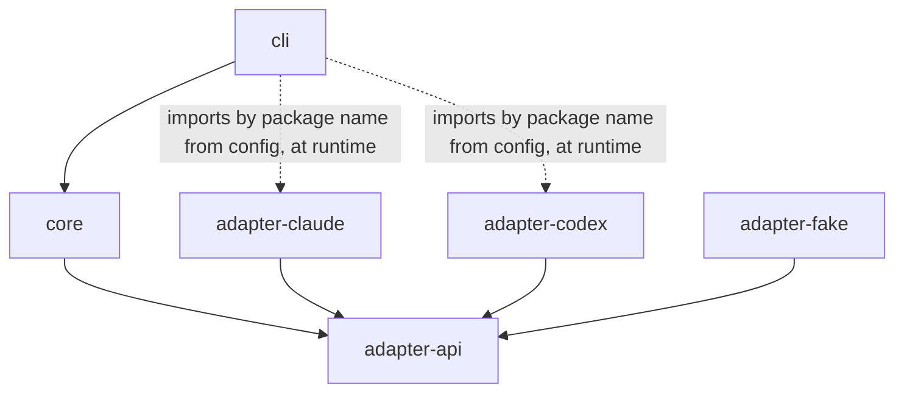

# 02 — Component map

Monorepo, pnpm workspace, TypeScript ([ADR-0004](adr/0004-language-typescript-node.md)).
Package names are provisional.

```
packages/
  adapter-api/         The contract. Types only + the conformance harness. Zero runtime deps.
  core/                Engine, contracts (zod), pack, isolation, dispatcher, verifier, confirmer, store.
  adapter-claude/      Implements adapter-api for Claude Code.
  adapter-codex/       Implements adapter-api for Codex CLI.
  adapter-fake/        Scripted adapter for core tests and conformance fixtures. Ships in the repo.
  cli/                 `conductor` binary. Thin. Argument parsing and printing only.
```

## Dependency direction



`adapter-api` is the only package an adapter author needs to read. It has no
dependency on `core`. `core` depends on `adapter-api`, never on a concrete
adapter. Adding a third vendor is a new package that depends on `adapter-api`
and passes the conformance suite; `core` is untouched
([04-worker-adapter-contract.md](04-worker-adapter-contract.md)).

There is no plugin system beyond "a package that exports `createAdapter()`".
The host (the CLI) dynamically imports the package named in config and hands
the resulting instances to the engine as `adapters: Record<provider, WorkerAdapter>`.
`core` never imports an adapter, not even dynamically: resolution from `core`'s
own location would only find packages `core` depends on, which is exactly the
coupling the boundary forbids. That is the whole mechanism.

## Modules inside `core`

| Module | Responsibility | Depends on | Must not know about |
|--------|----------------|------------|---------------------|
| `contracts/` | zod schemas for TaskSpec, ContextPack, WorkProduct, Verdict, VerificationResult, RoundRecord; JSON Schema export for worker output files | — | vendors, git, files |
| `config/` | Load and validate `~/.conductor/config.yaml` and `<repo>/.conductor/config.yaml`; resolve roles → (provider, model label, effort) | contracts | — |
| `task/` | Parse `task.md` (YAML frontmatter + markdown body) into TaskSpec; apply repo defaults | contracts, config | — |
| `isolation/` | `git worktree add/remove/prune`, detached at `base_sha`; setup hook; diff extraction with pathspec exclusions; patch apply; harvest; orphan detection; hooks path | git CLI | vendors, prompts |
| `pack/` | Render the base pack and role addenda to a directory; compute `pack_id`; inline instruction sources; strip vendor frontmatter; lint for vendor-specific syntax | contracts, task, instructions | vendors |
| `instructions/` | Discover instruction sources (AGENTS.md, skills, invariant docs); projection and drift check for `doctor` | filesystem | vendors (beyond file naming conventions) |
| `dispatcher/` | Turn a step into a WorkerJob; acquire a provider lease (DB row); spawn via adapter; enforce idle/total timeouts; classify result; retry/degrade per policy; record `provider_events` | adapter-api, store, config | prompt content, git |
| `verifier/` | Run verification steps in a worktree; capture logs; parse junit/eslint/tsc/pytest output into structured failures | isolation (for cwd), contracts | vendors |
| `confirmer/` | For each finding's reproduction: harvest, apply, run, compare to expectation; produce confirmation status | isolation, verifier | vendors |
| `engine/` | The round state machine; decides converge/iterate/escalate/abort; gates; budgets | everything above | vendor specifics, CLI output formatting |
| `store/` | SQLite schema, migrations, blob dir layout, queries for `show`, `stats`, `export` | node:sqlite | — |
| `notify/` | Terminal bell, macOS notification, optional shell hook on gate/escalation | — | — |

Boundary rule for contributors: **if a change to `core` mentions a vendor
name, a flag, or an event type from a specific CLI, it is in the wrong
package.**

## Modules inside an adapter

| Module | Responsibility |
|--------|----------------|
| `detect.ts` | Find the binary (config path or `PATH`), read `--version`, check auth, check the isolated vendor home, return a `Detection` |
| `capabilities.ts` | Map `Detection` to a `CapabilitySet` by parsing `--help` and version ranges; cache key = binary path + version + mtime |
| `command.ts` | Build argv/env for a `WorkerJob`, translating the vendor-neutral `SandboxPolicy` to vendor flags; every optional flag tagged droppable |
| `events.ts` | Parse the vendor's stdout into normalized `WorkerEvent`s, keeping `raw`; one parser per known format, selected by capability |
| `classify.ts` | Map exit code + events + stderr into a `Classification` (never exit code alone) |
| `fixtures/` | Recorded real stdout/stderr per version, used by offline conformance |

## What is core and what is plugin

Core: contracts, engine, isolation, verifier, confirmer, store, pack, config,
dispatcher policy. These encode the methodology and never change per vendor.

Plugin: adapters. Each is roughly 400–800 lines and is expected to be
rewritten when its vendor changes formats. The design assumes adapters are
disposable and the core is not.

Not a plugin, not core: workflow templates (`feature`, `bugfix`) and role
prompt templates. They are data files in `core/templates/`, overridable per
repo under `.conductor/templates/`. They are the methodology and the operator
edits them directly. Deliberately **not** a workflow engine: the engine is a
fixed state machine with a per-kind prologue step
([05-loop-control.md](05-loop-control.md)).

## Filesystem layout at runtime

```
~/.conductor/
  config.yaml                     global config: providers, roles, loop defaults
  conductor.db                    SQLite (WAL mode)
  runs/<run_id>/
    task.json                     frozen TaskSpec
    pack/                         rendered pack (base + per-role addenda)
    rounds/<n>/
      implement/  events.jsonl stdout.log stderr.log prompt.md report.json
      verify/     <step_id>.stdout <step_id>.stderr junit.xml ...
      review-<k>/ events.jsonl ... verdict.json harvest/<files>
      confirm/    <finding_id>.stdout ...
    result.patch                  final diff vs base_sha (excluding .conductor/)
    state.json                    last known status, pid, heartbeat (for orphan detection)
  worktrees/<run_id>/
    impl/                         detached at base_sha; persists across rounds
    review-<n>-<k>/               base_sha + patch; deleted after harvest
  vendor/
    codex-home/                   CODEX_HOME: auth.json symlink + conductor config.toml
    claude-settings.json          passed via --settings; conductor-owned permissions
  STOP                            kill-switch sentinel (presence pauses dispatch)

<repo>/.conductor/
  config.yaml                     repo config: setup, verification, repro paths, policy, instruction sources
  templates/                      optional overrides of role prompts and workflows
```

Inside a worktree during a run:

```
<worktree>/.conductor/pack/       copy of the pack (read by the worker)
<worktree>/.conductor/out/        worker writes report.json / verdict.json here
```

`.conductor/pack/` and `.conductor/out/` each contain a `.gitignore` holding
`*`, so they ignore themselves: a worker's `git status` never shows them and
no shared file is touched. (`info/exclude` lives in the common directory of
the repository and is shared with every worktree including yours, where it
would also have hidden the tracked `.conductor/config.yaml`.) They are
additionally excluded from diffs by pathspec.
