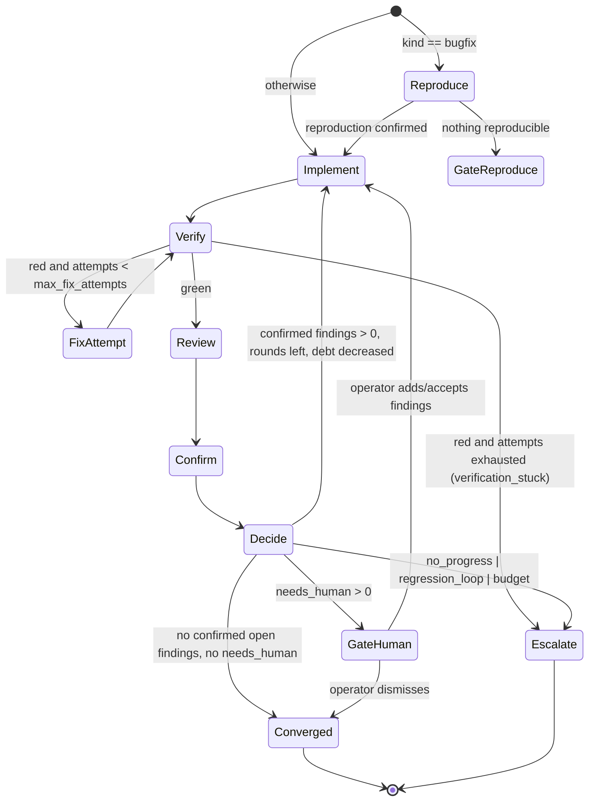

# 05 — Loop control and termination

## The idea in one sentence

**The loop does not iterate on opinions. It iterates on a set of executable
checks that only grows, and it stops when the set is green or when a round
fails to shrink the red part.**

Everything below follows from that. The reviewer's job is to grow the set of
checks (by writing reproductions). The implementer's job is to make the set
green. The conductor's job is to run the set and count.

## Workflow templates

Two, as data. Not a workflow engine.

```
feature:   implement → verify → review → decide
bugfix:    reproduce → implement → verify → review → decide
```

`reproduce` is a `reproducer` worker (usually the reviewing vendor) that
writes a failing test or command demonstrating the reported bug *before*
anyone touches product code. Its output is harvested exactly like a
reviewer's reproductions and becomes the first entry in the verification
plan. If the reproducer cannot reproduce, the run gates to the operator
before spending any implementer quota. This is your existing "fix a reported
bug" workflow made mechanical.

`refactor` and `chore` use the `feature` template with a different prompt.

## Before round 1: the baseline must be green

Added after the first live run (see [15-implementation-status.md](15-implementation-status.md)).
The conductor runs the repo's verification steps on the untouched worktree
at `base_sha` before any worker is spawned. If a required step is already
red the run aborts with zero quota spent.

The reason is not tidiness. With a red baseline, the implementer's fix
targets are *your broken checks*, and a capable model will make them pass by
whatever means work. In the first live run the toy repo's test command was
wrong for the installed Node; the implementer deleted the existing test file
and moved its contents to a path the broken command happened to accept, and
the reviewer approved it. Every part of the loop behaved as designed, and the
output was a hack. "Verification is the only ground truth" holds only if the
ground was level to begin with.

Acceptance checks are excluded from the baseline: they are supposed to fail
until the work is done. `loop.verify_baseline: false` or `--skip-baseline`
turns it off for repos whose suite is too slow to run twice.

Related guard: the patch's deleted files are always surfaced to the operator,
because deleting a test is the cheapest way to turn a check green.

## The round state machine



Key properties:

- **Review only sees green.** If verification is red after the implementer
  runs, the implementer gets up to `max_fix_attempts_per_round` fix attempts
  in the same worktree (with resume if the adapter supports it) before any
  reviewer is spawned. Reviewer quota is never spent on code that is about to
  change anyway.
- **Reviewers run in parallel** if more than one is configured, each in its
  own worktree, and their verdicts are unioned after confirmation. There is
  no need to reconcile their opinions because opinions do not act.
- **Confirmation is a conductor step**, not a model step. It runs in the
  implementer's worktree after the reviewers have exited.

## Confirmation: turning findings into facts

For each finding, by reproduction kind:

| Kind | What the conductor does | Confirmed when |
|------|--------------------------|----------------|
| `test` | Harvest `files` from the reviewer's worktree (must match `repro_allowed_paths`, must not touch files the implementer changed, ≤ `max_files`); copy into the implementer worktree; run `run` | exit ≠ 0 |
| `command` | Run `run` in the implementer worktree with the verification environment | exit matches `expect_exit` (default: any nonzero), or stdout matches regex |
| `acceptance` | Look up the criterion; run its `check` | the check fails |
| `none` | Nothing | never |

Outcomes:

- **confirmed** → enters the loop as a `FixTarget`. For `test` kind, the
  harvested files are added to the verification plan for the rest of the run
  (they are now part of "green"). The files are in the final patch; the
  operator sees them as tests the reviewer contributed.
- **refuted** → the reproduction passed on the implementer's tree. The finding
  becomes advice with the note "reviewer claimed X; reproduction did not
  fail". Harvested files are removed from the implementer worktree but kept
  in the run dir. The corpus records a false positive for that reviewer.
- **unappliable** → files outside allowed paths, conflict with implementer
  changes, or the command errored in a way that is not a failure (e.g.
  command not found). Advice, with the reason.
- **needs_human** → `kind: none` on a `security` or `data-loss` finding of
  severity ≥ major, or an `acceptance` reproduction pointing at a `manual`
  criterion. The run gates.

A reviewer that produces only advice has cost quota and changed nothing. The
corpus makes that visible per model
([07-state-and-corpus.md](07-state-and-corpus.md)).

## Testing your prior

Your prior: a finding is worth acting on only if it can be expressed as a
failing test or a concrete reproduction; otherwise it is advice.

I accept it with two carve-outs, both of which route to you rather than to
the loop:

1. **Security and data-loss** findings without a reproduction are not
   silently demoted. Some of the worst defects are cheap to see and expensive
   to reproduce (a migration that drops a column, an auth check on the wrong
   branch). They gate.
2. **Spec mismatch against a `manual` acceptance criterion** gates, because
   the operator wrote that criterion knowing only they could judge it.

Everything else is advice. Advice is in the final report, never in the
implementer's next prompt. If you find yourself wanting advice in the loop,
the fix is to convert it into an acceptance criterion with a check, not to
loosen the rule.

The falsifying experiment is milestone M0 in
[10-milestones.md](10-milestones.md): run real diffs through a reviewer with
this schema and count confirmed findings. If reviewers rarely produce
reproductions that confirm, the loop degenerates to "implement, verify,
report" and the review round should be made optional by default.

## Termination

### Decision table (after confirmation)

| Verification | Confirmed open findings | needs_human | Rounds left | Debt decreased | Action |
|---|---|---|---|---|---|
| green | 0 | 0 | — | — | **converged** |
| green | 0 | > 0 | — | — | **gate** (operator decides) |
| green | > 0 | any | yes | yes (or round 1) | **iterate** |
| green | > 0 | any | yes | no | **escalate** `no_progress` |
| green | > 0 | any | no | — | **escalate** `budget` |
| red after fix attempts | — | — | — | — | **escalate** `verification_stuck` |

### Monotonic progress

```
debt = failing_required_steps + confirmed_open_findings
```

Round N+1 must have `debt < debt(N)`. Equal is not progress. A round that
fixes one finding and introduces one new confirmed finding escalates. This
is deliberately strict: a loop that trades defects is the ping-pong you are
worried about, and the cheapest way to detect it is to refuse to tolerate a
flat round.

Additional guards, each an escalation reason:

- **regression_loop**: a finding with `regression_of` pointing at a finding
  that was already fixed once. Second recurrence of the same defect.
- **empty_diff**: implementer's patch hash unchanged after an iterate or fix
  attempt, or empty in round 1 with the report saying `not_done`.
- **invalid_output_twice**: a worker fails to produce a schema-valid output
  file after one repair turn.
- **scope_explosion**: `files_changed` exceeds three times the number of files
  matching `touch_hint` and is above 20. Advisory in round 1, escalation
  afterwards.

### Budgets

All from `TaskSpec.budget`, defaults in config:

| Budget | Default | Enforced by |
|---|---|---|
| `max_rounds` | 3 | engine |
| `max_fix_attempts_per_round` | 2 | engine |
| `max_worker_runs` | 8 | dispatcher (counts every spawn, including repairs and retries) |
| `max_wall_ms` | 45 min | engine; running workers are killed at the deadline |
| `max_reviewers` | 1 | dispatcher; lowered under quota pressure |

Quota exhaustion is **not** a budget failure. It pauses the run
(`waiting_quota`) and the run resumes when a provider cools down or the
operator resumes it ([06-scheduler.md](06-scheduler.md)).

### Disagreement

- Reviewer says blocker, reproduction refuted → verification wins; advice.
- Reviewer says approve, verification red → verification wins; the round does
  not even reach review.
- Two reviewers disagree → irrelevant; union of confirmed findings.
- Reviewer and implementer disagree on a confirmed finding (implementer's
  report says "intended behavior") → the finding stays open; the operator
  sees both at the next gate or in the final report. The implementer is told
  in its prompt that it may push back in `open_questions` but must still make
  the reproduction pass or explain why the reproduction is wrong. If it
  changes the reproduction file itself, the harvest guard catches it
  (modifying a harvested file is treated like modifying a verification step:
  flagged `tampered`, and the original is restored before verification).
- Third model as tie-breaker: not in v1. Nothing to break ties on.

## Repair turns

When a worker's output file is missing or invalid, the dispatcher runs one
repair turn: resume the session if `caps.resume`, else a fresh run with the
original prompt plus the validation errors and the invalid content. The
repair counts against `max_worker_runs`. A second failure is
`invalid_output_twice`. For an implementer, the *patch* is still valid even
if the report is not; the run continues with `report_valid: false` and the
reviewer is told the report is missing. For a reviewer, an invalid verdict
means that reviewer produced nothing this round.

## Gates

`after_reproduce`, `after_implement`, `after_review`, `before_apply`. At a
gate the process prints a summary and waits on stdin (or, with `--no-wait`,
exits with status `gated` and the run resumes via `conductor resume <run>`).
The operator can: continue, add a finding by hand (it becomes a `FixTarget`
with `reproduction: none` and is exempt from the executable rule because the
operator is the human in the loop), dismiss `needs_human` findings, edit
`decisions` (carried into the pack), or abort.

## Prompt templates

`core/templates/implementer.md`, `reviewer.md`, `reproducer.md`. They are
short, vendor-neutral, and reference the pack files by relative path. The
reviewer template's most important paragraph, roughly:

> For every finding of severity blocker or major you MUST provide a
> reproduction: a test file you create under one of the allowed paths that
> fails against the current tree, or a command that exits nonzero, or an
> acceptance criterion id. A finding without one will be recorded as advice
> and will not be acted on. Do not fix the code. Anything you change outside
> the allowed paths is discarded.

Your `expert-review` skill is inlined above it as an `InstructionDoc`. The
template does not restate methodology; it states the contract.
